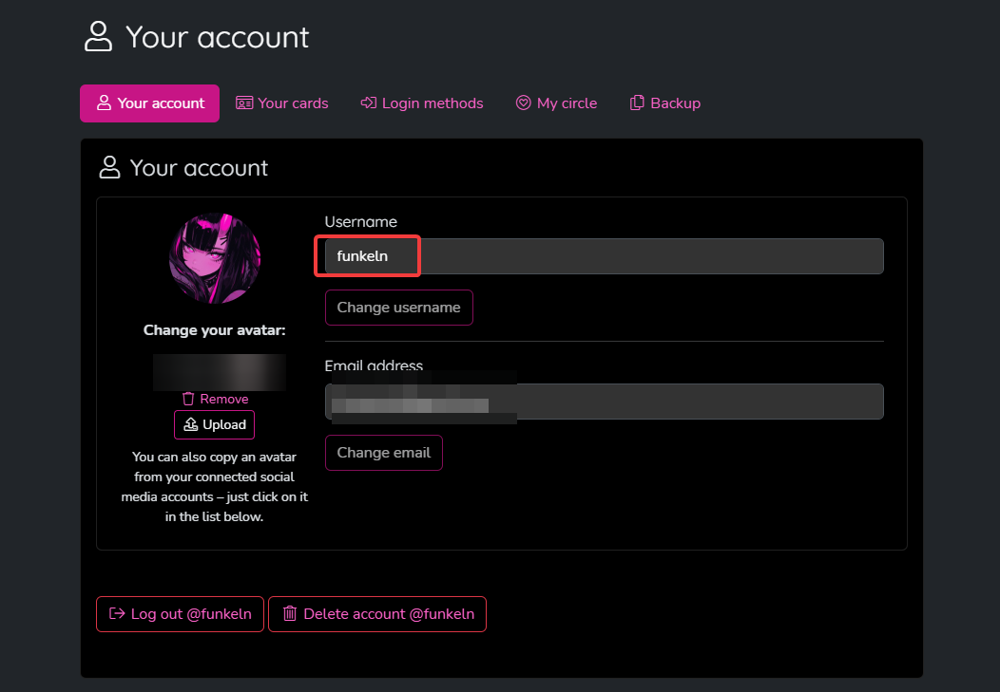
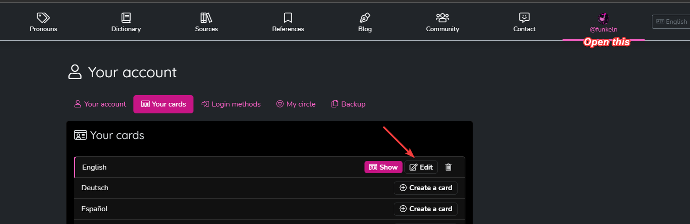

# Pronouns

## How to use

- Open up https://en.pronouns.page/ and create an Account
- Note your Username on Pronouns.page down 
- Login and create a card, MAKE SURE IT IS ENGLISH AND NOT GERMAN, if you already have one, Edit it 
- Go into Pronouns and Flags and add your pronouns and flags (max 3 ingame supported)
- Download the addon from the ["Releases"](https://github.com/HerXayah/pronound-addon/releases/latest) on the side and install it into `%appdata%\.minecraft\labymod-neo\addons`
- Start client and before you connect to any server go into addon settings
- Enter your pronouns.page username into the field and then connect
